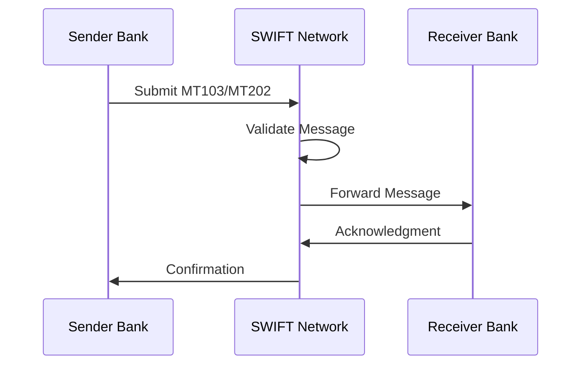
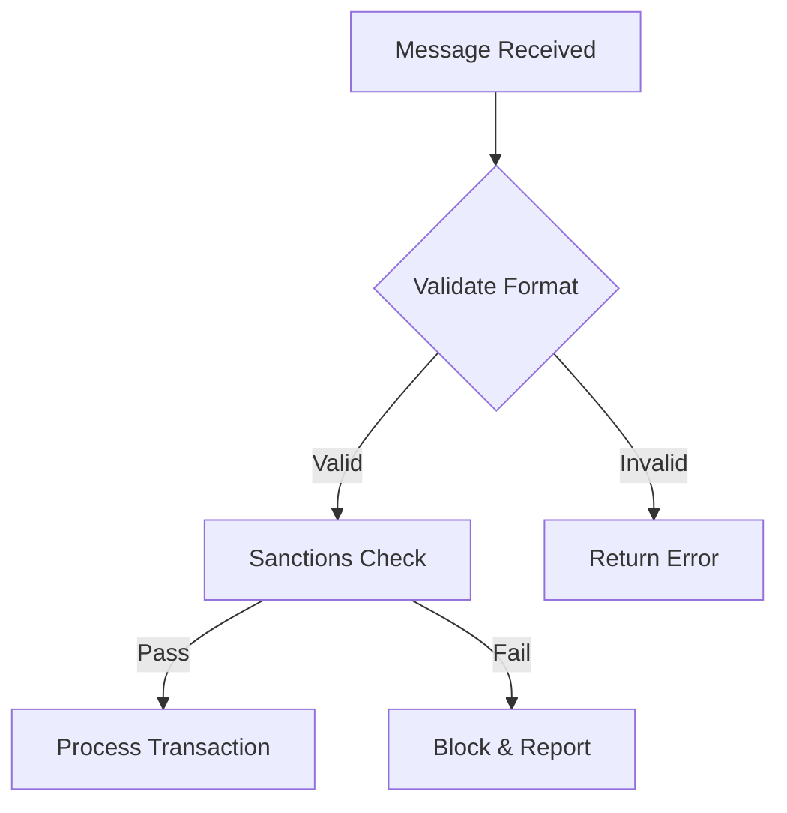
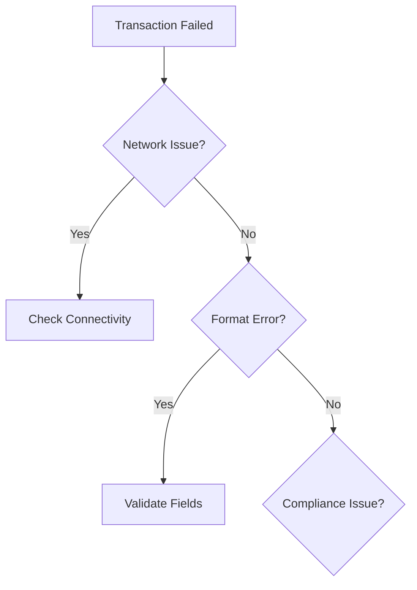

# SWIFT Transaction Guidelines

## Overview
This document provides comprehensive guidelines for handling SWIFT MT103 and MT202 transactions, including technical requirements, security protocols, and compliance measures.

## Enhanced Security Framework
### Access Control Matrix
| Role | Transaction Limit | Approval Rights | Monitoring Access |
|------|------------------|-----------------|------------------|
| Operator | $10,000 | None | View Only |
| Supervisor | $100,000 | Level 1 | Full Access |
| Manager | $1,000,000 | Level 2 | Full Access |
| Administrator | Unlimited | Level 3 | Full Access |

### Real-time Monitoring Requirements
- Transaction velocity checks
- Pattern analysis
- Geographic risk assessment
- Amount threshold monitoring
- Time-zone based alerts

## Instructions for SWIFT MT103, MT202 Transactions
- **MT103**: Used for single customer credit transfers.
- **MT202**: Used for financial institution transfers.

## Detailed Guidelines for SWIFT Transactions
- **MT103**: Include details such as sender, receiver, amount, currency, and purpose of the transfer.
  - **Example**: A customer in the US sends $10,000 to a beneficiary in the UK for purchasing goods.
- **MT202**: Include details such as ordering institution, beneficiary institution, amount, and purpose of the transfer.
  - **Example**: A bank in Germany transfers €50,000 to a bank in France for interbank settlement.

## Step-by-Step Instructions for Executing SWIFT Transactions
1. **Prepare the Message**: Gather all necessary information, including sender and receiver details, amount, currency, and purpose.
2. **Validate the Message**: Ensure all fields are correctly filled and comply with SWIFT standards.
3. **Send the Message**: Use the SWIFT network to send the message securely.
4. **Monitor the Transaction**: Track the status of the transaction and confirm receipt by the beneficiary.

## Common Issues and Troubleshooting Tips for SWIFT Transactions
- **Incorrect Details**: Double-check all details before sending to avoid errors.
- **Network Delays**: Monitor the status of the transaction and follow up if necessary.
- **Compliance Issues**: Ensure all transactions comply with regulatory requirements.
- **Duplicate Transactions**: Verify transaction history to avoid sending duplicate payments.

## Technical Requirements
### System Requirements
- **Software Version**: SWIFT Alliance Access 7.5 or higher
- **Network**: Dedicated secure connection with minimum 10Mbps bandwidth
- **Hardware**: 
  - Minimum 16GB RAM
  - 4-core processor
  - 500GB storage
  - Hardware Security Module (HSM)

### API Integration
- REST API v2.0 compliance
- OAuth 2.0 authentication
- TLS 1.3 encryption
- Rate limiting considerations
- Webhook support for notifications

## Implementation Requirements

### Technical Prerequisites
- **Network Infrastructure**:
  - Dedicated SWIFT connection (minimum 10Mbps)
  - Redundant backup lines
  - Network segregation
- **Security Hardware**:
  - HSM (Hardware Security Module)
  - Dedicated secure terminals
  - Backup systems

### Software Requirements
- **SWIFT Alliance Access**: Version 7.5 or higher
- **Operating System**: Latest LTS version with security patches
- **Database**: High-availability cluster setup
- **Monitoring Tools**: Real-time transaction tracking

## Implementation Checklist
### Pre-deployment Requirements
- [ ] Network security assessment
- [ ] HSM configuration
- [ ] User access matrix setup
- [ ] Backup system verification
- [ ] Disaster recovery testing

### Post-deployment Verification
- [ ] End-to-end testing
- [ ] Performance benchmarking
- [ ] Security audit
- [ ] Staff training completion
- [ ] Documentation review

## Case Studies on SWIFT Transactions
- **Case Study 1**: Successful execution of a SWIFT MT103 transaction with detailed steps and outcomes.
- **Case Study 2**: Troubleshooting a failed SWIFT MT202 transaction, identifying issues, and resolving them.

## Additional Resources
- **SWIFT Standards**: Refer to the official SWIFT standards documentation for detailed message formats and guidelines.
- **Regulatory Compliance**: Ensure adherence to local and international regulations governing financial transactions.

## Importance of Compliance in SWIFT Transactions
Compliance with SWIFT standards and regulatory requirements is crucial to ensure the security and efficiency of international financial transactions. Non-compliance can lead to transaction delays, financial penalties, and reputational damage.

## Importance of Data Accuracy and Security in SWIFT Transactions
Ensuring data accuracy and security in SWIFT transactions is critical to prevent errors, fraud, and unauthorized access. Accurate data helps in the smooth processing of transactions, while robust security measures protect sensitive financial information.

## Security Measures and Best Practices
- **Access Control**: Implement strict user access controls and authentication
- **Data Encryption**: Use industry-standard encryption for all SWIFT messages
- **Audit Trails**: Maintain detailed logs of all SWIFT transactions
- **Regular Updates**: Keep SWIFT software and security patches up to date

## Advanced Security Protocols
### Multi-Layer Authentication
- Primary authentication via SWIFT credentials
- Secondary biometric verification
- Hardware security token requirements

### Encryption Standards
- TLS 1.3 or higher for all communications
- End-to-end encryption for message content
- Regular key rotation requirements

- **Multi-Factor Authentication**: Require multiple forms of verification
- **IP Whitelisting**: Restrict access to specific IP addresses
- **Session Management**: Implement automatic session timeouts
- **Cryptographic Controls**: Use advanced encryption standards

## Advanced Technical Controls
### Network Security
- Network segmentation
- Dedicated SWIFT VPN
- Real-time traffic monitoring
- Intrusion Detection System (IDS)
- DDoS protection measures

### System Monitoring
- Real-time transaction monitoring
- System health checks
- Performance metrics tracking
- Automated alerting system
- Log management and analysis

## Emergency Response Procedures
- **Incident Response Plan**: 
  - Immediate steps for security breaches
  - Communication protocols
  - Recovery procedures
- **Business Continuity**: 
  - Backup systems activation
  - Alternative processing methods
  - Data recovery protocols

## Transaction Validation Requirements
- **Sender Authentication**: Verify sender identity and authorization
- **Amount Verification**: Check transaction limits and available funds
- **Sanctions Screening**: Screen against sanctions lists and blocked entities
- **Format Validation**: Ensure message format meets SWIFT standards
  - Field lengths and character types
  - Mandatory field completion
  - Valid BIC codes and account numbers

## Enhanced Compliance Measures
- **Transaction Screening**: 
  - Real-time sanctions checking
  - PEP screening
  - Adverse media monitoring
- **Documentation Requirements**:
  - Transaction purpose verification
  - Source of funds documentation
  - Beneficiary verification

## Extended Compliance Measures
### Transaction Screening Requirements
- Real-time sanctions screening
- PEP verification process
- Dual control validation

### Documentation Standards
- Digital signature requirements
- Audit trail maintenance
- Record retention periods

## Integration Guidelines
### API Endpoints
- Transaction submission
- Status checking
- Report generation
- Account validation
- Balance inquiries

### Error Handling
- Standard error codes
- Retry mechanisms
- Fallback procedures
- Error logging requirements
- Notification protocols

## Cross-Border Requirements
- **Country-Specific Rules**: 
  - Local regulatory requirements
  - Reporting thresholds
  - Documentation standards
- **Currency Controls**:
  - Exchange restrictions
  - Reporting obligations
  - Settlement procedures

## Risk Management Guidelines
- **Transaction Monitoring**: Implement real-time monitoring systems
- **Fraud Detection**: Use automated systems to detect suspicious patterns
- **Contingency Planning**: Maintain backup systems and disaster recovery plans
- **Regular Testing**: Conduct periodic testing of security measures

## Reporting Requirements
- **Daily Reports**: Generate daily transaction summaries
- **Regulatory Reports**: Prepare reports for regulatory compliance
- **Audit Reports**: Maintain comprehensive audit trails
- **Incident Reports**: Document and report security incidents

## Performance Metrics
- **Processing Time**: Monitor average transaction processing time
- **Success Rate**: Track successful vs. failed transactions
- **Error Rate**: Monitor transaction error frequency
- **System Availability**: Track system uptime and performance

## Maintenance and Updates
### System Updates
- Scheduled maintenance windows
- Version upgrade procedures
- Patch management policy
- Testing requirements
- Rollback procedures

### Documentation Requirements
- API documentation
- System architecture diagrams
- Process flow documentation
- Security procedures
- Disaster recovery plans

## Contact Information
- **SWIFT Support**: Contact details for technical support
- **Compliance Team**: Internal compliance team contacts
- **Help Desk**: 24/7 help desk support information

## Summary of Key Points
- **MT103**: Single customer credit transfers, include sender, receiver, amount, currency, and purpose.
- **MT202**: Financial institution transfers, include ordering institution, beneficiary institution, amount, and purpose.
- **Steps**: Prepare, validate, send the message securely, and monitor the transaction.
- **Common Issues**: Incorrect details, network delays, compliance issues, duplicate transactions.
- **Resources**: SWIFT standards documentation, regulatory compliance guidelines.
- **Data Accuracy and Security**: Ensure accurate data entry and implement strong security measures.

## Message Format Specifications
### MT103 Format
- **Field 20**: Transaction Reference Number
- **Field 23B**: Bank Operation Code
- **Field 32A**: Value Date, Currency Code, Amount
- **Field 50A**: Ordering Customer
- **Field 59**: Beneficiary Customer
- **Field 70**: Remittance Information
- **Field 71A**: Details of Charges

### MT202 Format
- **Field 20**: Transaction Reference Number
- **Field 21**: Related Reference
- **Field 32A**: Value Date, Currency Code, Amount
- **Field 52A**: Ordering Institution
- **Field 58A**: Beneficiary Institution
- **Field 72**: Sender to Receiver Information

## Validation Rules
- **Field Lengths**: Ensure all fields meet the required lengths
- **Character Types**: Validate character types for each field
- **Mandatory Fields**: Check for the presence of all mandatory fields
- **BIC Codes**: Verify the validity of BIC codes
- **Account Numbers**: Validate account numbers for correct format

## Message Validation Framework
### Field Validation Rules
| Field | Format | Mandatory | Error Code | Resolution |
|-------|--------|-----------|------------|------------|
| 20 | 16x | Yes | ERR_001 | Check reference format |
| 32A | 6!n3!a15d | Yes | ERR_002 | Verify date/amount format |
| 50A | 35x | Yes | ERR_003 | Validate account format |
| 59 | 35x | Yes | ERR_004 | Check beneficiary details |

### Error Handling Procedures
1. **Format Errors**:
   - Log error details
   - Notify operations team
   - Request correction from sender

2. **Network Issues**:
   - Implement retry mechanism
   - Escalate after 3 failures
   - Switch to backup channel

## Security Framework
### Multi-Layer Authentication
- Primary authentication via SWIFT credentials
- Secondary biometric verification
- Hardware security token requirements

### Encryption Standards
- TLS 1.3 or higher for all communications
- End-to-end encryption for message content
- Regular key rotation requirements

## Extended Compliance Framework
### Transaction Monitoring
- **Real-time Screening**:
  ```json
  {
    "checkpoints": [
      "sanctions_screening",
      "pep_verification",
      "amount_threshold",
      "country_restrictions"
    ],
    "response_time": "< 2 seconds"
  }
  ```

### Error Resolution Matrix
| Error Code | Description | Severity | Resolution Steps |
|------------|-------------|----------|------------------|
| SWF001 | Invalid BIC | High | Verify BIC format and existence |
| SWF002 | Amount limit exceeded | High | Check authorization level |
| SWF003 | Network timeout | Medium | Retry with exponential backoff |

## Performance Monitoring
### Key Metrics
- Transaction processing time: < 5 seconds
- System availability: 99.99%
- Error rate threshold: < 0.01%

### Monitoring Dashboard Example
```yaml
metrics:
  transaction_success_rate:
    threshold: 99.9%
    alert_channel: ops_team
  response_time:
    threshold: 5000ms
    alert_channel: tech_support
```

## Disaster Recovery
- **Incident Response Plan**: 
  - Immediate steps for security breaches
  - Communication protocols
  - Recovery procedures
- **Business Continuity**: 
  - Backup systems activation
  - Alternative processing methods
  - Data recovery protocols

## Support and Escalation
### Contact Matrix
| Level | Contact | Response Time |
|-------|---------|---------------|
| L1 | ops@swift.local | 15 minutes |
| L2 | tech.lead@swift.local | 30 minutes |
| L3 | cto@swift.local | 1 hour |

## Appendix
### Sample Configurations
- **API Endpoints**:
  - Transaction submission
  - Status checking
  - Report generation
  - Account validation
  - Balance inquiries

### Error Handling
- Standard error codes
- Retry mechanisms
- Fallback procedures
- Error logging requirements
- Notification protocols

## API Documentation and Integration
### REST API Endpoints
```typescript
// Transaction submission endpoint
POST /api/v2/swift/transfer
{
  "messageType": "MT103",
  "sender": "BANKUSXX",
  "receiver": "BANKGBXX",
  "amount": 10000.00,
  "currency": "USD",
  "details": {
    "field20": "TRANSFER123456",
    "field32A": "230815USD10000,00",
    // ...additional fields...
  }
}
```

### Message Flow Diagram


### Transaction Processing Flowchart


## Enhanced Security Protocols
### Encryption Implementation
```python
# Example encryption configuration
encryption_config = {
    "algorithm": "AES-256-GCM",
    "key_rotation": "7_days",
    "tls_version": "1.3",
    "cipher_suites": [
        "TLS_AES_256_GCM_SHA384",
        "TLS_CHACHA20_POLY1305_SHA256"
    ]
}
```

## Troubleshooting Decision Tree


### Error Resolution Examples
```json
{
    "error_code": "SWF001",
    "resolution_steps": [
        {
            "step": 1,
            "action": "Verify BIC format",
            "validation": "^[A-Z]{6}[A-Z2-9][A-NP-Z0-9]([A-Z0-9]{3})?$"
        },
        {
            "step": 2,
            "action": "Check BIC directory"
        }
    ]
}
```

## Performance Optimization Guidelines
### Monitoring Configuration
```yaml
monitoring:
  transaction_latency:
    warning_threshold: 3000ms
    critical_threshold: 5000ms
  success_rate:
    minimum: 99.95%
  concurrent_connections:
    maximum: 1000
  rate_limiting:
    requests_per_second: 100
```
